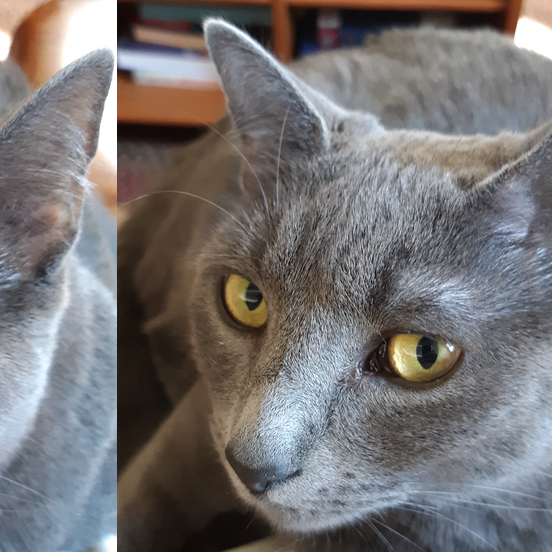
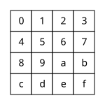
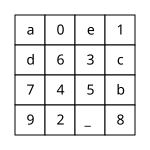

**Due**:

* Milestone 1 due **Friday, Sept 25th** by 11 pm
* Milestone 2 due **Friday, Oct 2nd** by 11 pm
* Milestone 3 due **Friday, Oct 9th** by 11 pm

This is a **pair** assignment, so you may work with one partner.

<div class='admonition danger'>
  <div class='title'>Warning!</div>
  <div class='content' markdown='1'>
Assembly language programming is challenging! Make sure
you start each milestone as soon as possible, work steadily, and
ask questions early.  Also, writing unit tests and using `gdb` to
examine the detailed behavior of code under test will be critical
to successful implementation of the assembly language functions.
  </div>
</div>

## Overview

In this assignment, you will implement transformations on image files,
using both C (in Milestone 1) and x86-64 assembly language (in Milestones 2 and 3.)

### Milestones

In Milestone 1, you are required to implement all of the image transformations
in C. You are also required to implement comprehensive unit tests for all of the
helper functions you use to implement the transformations. The intent is that
your assembly language code in Milestones 2 and 3 will implement the same
helper functions, and your unit tests will help you gain confidence in their
correctness.

In Milestone 2, you are required to implement the
[`wrap`](#the-wrap-transformation) and
[`blocky`](#the-blocky-transformation)
transformations in assembly language. We expect you to have comprehensive unit tests
for the assembly language implementations of your helper functions. (In theory you can
just use the ones you implemented in Milestone 1.) Note that we will not officially
grade the quality and comprehensiveness of your unit tests until Milestone 3.

In Milestone 3, you will implement the
[`puzzle`](#the-puzzle-transformation) and
[`rainbow_h`](#the-rainbow_h-transformation)
transformations in assembly language.

Note that in each milestone, we expect all of the tests executed
by your unit test program to pass. For Milestone 2 in particular, you can
comment out calls to test functions that aren't related to
helper functions needed for Milestone 2. For example, for Milestone 2 your `imgproc_test.c`'s
`main` function might have code similar to the following:

```c
TEST( test_get_rgba );
TEST( test_make_pixel );
//TEST( test_compute_rainbow_rgb );
```

The tests for `get_rgba` and `make_pixel`
are enabled because they are all test functions involved
in the implementations of the transformations
required for MS2. The test for `compute_rainbow_rgb` 
is commented out because it is used in the `rainbow_h`
transformation, which is not part of the requirements for MS2.

### Non-functional requirements

In Milestones 2 and 3, you will be writing assembly language functions.
You **must** write these "by hand", and your assembly code must have
very detailed code comments explaining the purpose of each assembly language
instruction.

<div class='admonition tip'>
  <div class='title'>Assembly comments</div>
  <div class='content' markdown='1'>
A good rule of thumb is that *every* assembly language instruction
should have a comment describing what it is intended to do.
  </div>
</div>

It is **not** allowed to generate assembly
code using a C compiler and submit this as your own code. We will assign
a grade of 0 to any submissions containing compiler-generated code
where hand-written assembly language is expected.

Your submission for each milestone should include a `README.txt` file
describing how you and your partner divided the work, and letting
us know about any interesting implementation details. If there is
functionality you weren't able to get working completely, this is
a good place to mention that.

We expect you to follow the [style guidelines](style.html).
However, the expectations for function length will be relaxed considerably
for your assembly language code. It is not unusual for an assembly language
function to have 100 or more lines of code. In the reference solution,
the longest function was about 149 lines, although there was extensive use of
comments and whitespace to improve readability.

Of course, you should strive to make your assembly language functions
as simple and readable as possible.

We expect your code to be free of memory errors. You should use
`valgrind` to test your code to make sure there are no uses
of uninitialized variables, out of bounds memory reads or writes,
etc.  This applies to both your C code and your assembly code.

<div class='admonition info'>
  <div class='title'>Note</div>
  <div class='content' markdown='1'>
If any test assertions fail when you run the unit test program,
that may lead to a memory leak due to one or more test objects
not being freed. This situation does not count as a memory leak
in your code. (However, you should definitely fix the bug that
is causing the test assertion to fail.)
  </div>
</div>

### Grading breakdown

Milestone 1: 30%

* Implementation of C image transformation functions: 12.5%
* Unit testing of helper functions: 12.5%
* Design/coding style of C functions: 5%

Milestone 2: 35%

* Functional correctness of `imgproc_wrap` and `imgproc_blocky`: 30%
* Design/coding style of assembly functions: 5%

Milestone 3: 35%

* Functional correctness of `imgproc_puzzle`: 10%
* Functional correctness of `imgproc_rainbow_h`: 10%
* Unit testing of helper functions: 10%
* Design/coding style of assembly functions, code walkthrough: 5%

## Getting started

In a terminal, change directory to your local clone of your
CSF project repository.

Download the starter code:

```text
curl -O https://jhucsf.github.io/fall2026/assign/csf_assign02.zip
```

Unzip the zipfile, and add, commit, and push the starter code to your
CSF project repository:

```text
unzip csf_assign02.zip
git add csf_assign02
git commit -m'add assignment 2 starter code to project repo'
git push
```

Now you can delete the starter code zipfile:

```text
rm csf_assign02.zip
```

Change directory into the `csf_assign02` subdirectory within your CSF
project repository:

```text
cd csf_assign02
```

You will implement the functions in `c_imgproc_fns.c` (Milestone 1)
and `asm_imgproc_fns.S` (Milestones 2 and 3.) You will also add
prototypes for helper functions to `imgproc.h` and implement additional
unit tests in `imgproc_tests.c`.

## Image processing

This section describes the image format and the image transformations
you will implement.

### struct Image

An instance of the `struct Image` data type represents a grid of
pixels, where each pixel has 8-bit red, green, and blue color
component values, as well as an 8-bit alpha value.

The `struct Image` type is defined as follows (in `image.h`):

```c
struct Image {
  int32_t width;
  int32_t height;
  uint32_t *data;
};
```

The `width` and `height` fields define the width and height of an image,
in pixels. The `data` field is a pointer to a dynamically-allocated array
of `uint32_t` values, each one representing one pixel. The pixels are stored
in row-major order, starting with the top row of pixels.

A color is represented by a `uint32_t` value as follows:

* Bits 24-31 are the 8 bit red component value, ranging from 0–255
* Bits 16-23 are the 8 bit green component value, ranging from 0–255
* Bits 8–15 are the 8 bit blue component value, ranging from 0–255
* Bits 0–7 are the 8 bit alpha value, ranging from 0–255

This pixel data format is known as "RGBA".

The alpha value of a color represents its opacity, with 255 meaning
"fully opaque" and 0 meaning "fully transparent".

### Image transformation functions

You will implement the following image transformation functions in both
C and assembly language:

```c
void imgproc_wrap( struct Image *in, struct Image *out,
                   int32_t dist );
void imgproc_blocky( struct Image *in, struct Image *out,
                     int32_t blocksize );
void imgproc_puzzle( struct Image *in, struct Image *out,
                     const char *positions );
void imgproc_rainbow_h( struct Image *in, struct Image *out );
```

These functions are declared in `imgproc.h`, and each one has a brief API
comment summarizing its function, the meaning of the parameters, and the
meaning of the return value (for the non-`void` functions.)
The full description of the behavior of each function is
in the following sections.

### The `wrap` transformation

The `wrap` transformation takes the pixels in the original image and
moves them horizontally by a specified integer distance. For example, a
distance of 10 would mean that each pixel in the original image would move
10 pixels to the right. Pixels that move past the edge of the
image wrap around back to the other edge. For example, if the wrap distance
is 10, and the width of the image is 800, the pixels in the rightmost
column of the original image (column 799) would be copied to column 9
of the output image.

Note that the wrap distance could be negative. A wrap distance of -1
would mean that every pixel moves one position to the left, and the pixels
in the leftmost column (column 0) of the original image would move to the
rightmost column of the output image.

Also note that the transformation is expected to handle arbitrary distances,
even if their absolute value is greater than the width of the image. For
example, if an image is 800 pixels wide, a wrap distance of 800 should be
treated as 0, a wrap distance of 801 should be treated as 1, as so forth.

Example:

Original image | Transformed image<br>(wrap distance=117)
:------------: | :---------------:
<a href="img/ingo.png"></a > | <a href="img/ingo_wrap_117.png"></a>

### The `blocky` transformation

In the `blocky` transformation, each pixel in the output image is copied
from a specific pixel of the input image, based on a *block size* parameter
that is guaranteed to be positive.

Let's say the block size is $$n$$, the output pixel column is $$j$$,
the output pixel row is $$i$$, the image width is $$w$$, and the image
height is $$h$$. The output pixel should be copied from the
input pixel whose column is $$\lfloor j / n \rfloor \times n$$ and
whose row is $$\lfloor i / n \rfloor \times n$$.

Copied pixels should be copied exactly, including the alpha value.

Example:

Original image | Transformed image<br>(block size=7)
:------------: | :---------------:
<a href="img/ingo.png"></a > | <a href="img/ingo_blocky_7.png"></a>

### The `puzzle` transformation

The `puzzle` transformation divides the image into 16 equal-sized
tiles. (This transformation can only be applied to images where
both the width and height of the image are exact multiples of 4.)

The `positions` argument is a string value containing
16 characters. Each character is either a hex digit (`'0'`–`'9'`
or `'a'`–`'f'`), or an underscore (`'_'`). The hex digits map onto
tile positions in the input image as follows:

<div style='text-align: center;'>
  
</div>

The positions string indicates, for each tile in the output image,
which input tile it is copied from. For example, if the tile string
is "`a0e1d63c745b92_8`", that means that the output image
should be arranged as

<div style='text-align: center;'>
  
</div>

Note that the underscore character ("`_`") indicates a tile that is
empty, and all of its pixels should be left as opaque black.

Original image | Transformed image<br>(positions="`a0e1d63c745b92_8`")
:------------: | :---------------:
<a href="img/ingo.png"></a > | <a href="img/ingo_puzzle_a0e1d63c745b92_8.png"></a>

### The `rainbow_h` transformation

For each pixel in the input image, the `rainbow_h` transformation

1. computes a full-intensity rainbow gradient color based on the
   pixel's horizontal position in the image
2. computes the pixel intensity of the source pixel, based on its
   RGB value
3. computes an output pixel color by applying the source's
   pixel's intensity to the full-intensity rainbow gradient color

The source pixel's column number (in the range $$0..w-1$$, where $$w$$
is the image width) should be mapped onto the range $$0..999{,}999$$.
This normalized column number should be computed as

$$\left\lfloor \frac{j \times 999{,}999}{w - 1} \right\rfloor$$

where $$j$$ is the input pixel column and $$w$$ is the image width.

Next, the full-intensity RGB values of the rainbow gradient
color should be computed. There are 5 "zones" in the gradient,
which work as follows:

Zone | Normalized columns<br>(inclusive) | RGB values
---- | --------------------------------- | ----------
0    | $$0..199{,}999$$                  | r=$$65{,}535$$, g=ramp up, b=$$0$$
1    | $$200{,}000..399{,}999$$          | r=ramp down, g=$$65{,}535$$, b=$$0$$
2    | $$400{,}000..599{,}999$$          | r=$$0$$, g=$$65{,}535$$, b=ramp up
3    | $$600{,}000..799{,}999$$          | r=$$0$$, g=ramp down, b=$$65{,}535$$
4    | $$800{,}000..999{,}999$$          | r=ramp up, g=$$0$$, b=$$65{,}535$$

Note that the computed RGB values are in the range $$0..65{,}535$$
rather than the usual $$0..255$$, to allow for additional precision when
applying the intensity to the rainbow RGB color.

"Ramp up" and "ramp down" mean that a color component value is either
ramping up from $$0$$ to $$65{,}535$$ or ramping down from
$$65{,}535$$ to $$0$$.  Let's say that the normalized pixel column is
$$x$$ distance from the beginning of the range. (E.g., in zone 1,
the normalized pixel column $$200{,}010$$ would be at distance $$10$$
from the beginning of the range.) The effective color component when
ramping up would be

$$\left\lfloor \frac{65{,}535 \times x}{199{,}999} \right\rfloor$$

The effective color component when ramping down is found by substituting
$$199{,}999 - x$$ for $$x$$ in the ramping up calculation.

Once the full-intensity RGB values are computed (each will be in the
range $$0..65{,}535$$), the next step is to compute the intensity of
the input pixel. Assuming that $$r$$, $$g$$, and $$b$$ are the red,
green, and blue color component values of the input pixel (each in
the range $$0.255$$), the intensity $$t$$ should be computed as

$$t = 79 \times r + 128 \times g + 49 \times b$$

This will yield an intensity value in the range $$0..65{,}280$$.
Intensity-adjusted rainbow RGB values should now be computed.
If $$c$$ is one of the full-intensity rainbow RGB values (in the
range $$0..65{,}535$$), then the intensity-adjusted value should be

$$\left\lfloor \frac{c \times t}{65{,}280} \right\rfloor$$

Finally, from each intensity-adjusted RGB value $$c$$, an output
RGB value can be computed as $$\lfloor c/256 \rfloor$$. The final
output RGB values should then be combined with the unmodified
alpha value of the input pixel to yield the output pixel's RGBA values.

Example:

Original image | Transformed image
:------------: | :---------------:
<a href="img/ingo.png"></a > | <a href="img/ingo_rainbow_h.png"></a>

## `c_imgproc` and `asm_imgproc` programs

The `c_imgproc` and `asm_imgproc` programs apply one of the image transformations
to an input image (or, in the case of the `composite` transformation, two input images),
and write the result to an output image file.  The `c_imgproc_main.c` source file
implements both of these programs. The only difference between `c_imgproc` and
`asm_imgproc` is whether the image transformations are implemented in C
(`c_imgproc_fns.c`) or x86-64 assembly language (`asm_imgproc_fns.S`.)

To run these programs:

<div class='highlighter-rouge'><pre><code>./c_imgproc <i>transformation</i> <i>input.png</i> <i>output.png</i> [<i>args...</i>]
./asm_imgproc <i>transformation</i> <i>input.png</i> <i>output.png</i> [<i>args...</i>]
</code></pre></div>

In these commands:

* <code class='highlighter-rouge'><i>transformation</i></code> is the name of the
  image transformation to perform
* <code class='highlighter-rouge'><i>input.png</i></code> is the name of the input
  image file
* <code class='highlighter-rouge'><i>output.png</i></code> is the name of the output
  image file to write
* <code class='highlighter-rouge'>[<i>args...</i>]</code> represents additional arguments
  needed by the transformation; for example, the `wrap` transformation needs
  one integer argument to specify the wrap distance

For example, to run the `wrap` transformation with a wrap distance of
117 using the `c_imgproc` program:

```text
mkdir -p actual
./c_imgproc wrap input/ingo.png actual/ingo_wrap_117.png 117
```

The commands in this example would apply the `wrap` transformation
with a wrap distance of 117 to the input image `input/ingo.png` to
product the output image file `actual/ingo_wrap_117.png`.

## Unit tests, helper functions

The source file `imgproc_tests.c` is a unit test program that you should use to
test the functions in `c_imgproc_fns.c` and `asm_imgproc_fns.S`.

The starter code has some very basic tests for the API functions implementing the
various image transformations. However, you will need to write unit tests for
your *helper functions*. The idea is that your assembly language code will implement
exactly the same helper functions as your C code, and having a comprehensive set
of unit tests for these helper functions will allow you to get your assembly code
working incrementally by implementing the helper functions one at a time.

<div class='admonition info'>
  <div class='title'>Tip</div>
  <div class='content' markdown='1'>
Having a good set of unit tests for your helper functions is essential for being
able to make steady progress towards getting your assembly code to work in
Milestones 2 and 3.
  </div>
</div>

You are free to implement whatever helper functions make sense. Some of
the helper functions defined in the reference implementation are:

```c
int32_t compute_index( struct Image *img, int32_t row, int32_t col );
void get_rgba( uint32_t pixel, uint32_t *r, uint32_t *g, uint32_t *b, uint32_t *a );
uint32_t make_pixel( uint32_t r, uint32_t g, uint32_t b, uint32_t a );
uint16_t ramp_up( int64_t x );
uint16_t ramp_down( int64_t x );
void compute_rainbow_rgb( int64_t x, uint16_t *r, uint16_t *g, uint16_t *b );
int32_t adjust_wrap_dist( int32_t img_width, int32_t dist );
```

## Image tests

The provided script `run_all.sh` runs your `c_imgproc` or `asm_imgproc` program
on some example input images and checks whether a correct output image
is produced. To run it:

```bash
# test the C implementations of the image transformations
./run_all.sh c
# test the assembly implementations of the image transformations
./run_all.sh asm
```

## Hints and tips

### x86-64 tips

Here are some x86-64 assembly language tips and tricks in no particular order.

Callee-saved registers are your best option to serve as local variables
in your assembly language functions. The callee-saved registers are
`%r12`, `%r13`, `%r14`, `%r15`, `%rbx`, and `%rbp`. If you are going
to store data in a callee-saved register, make sure that you use `pushq`
to save its value at the beginning of the function, and `popq` to restore
its value at the end of the function. (The `popq` instructions must be in
the opposite order as the `pushq` instructions.)

If you run out of callee-saved registers, then you can use memory in the
stack frame to store local variables. We *highly* recommend using an ABI-compliant
stack frame to reserve memory for local variables, since that will allow
`gdb` to properly recognize the functions on the call stack. To do so,
your function's prologue code should look like this:

<div class='highlighter-rouge'><pre><code>pushq %rbp
movq %rsp, %rbp
subq $N, %rsp
<i>...push callee-saved registers...</i>
</code></pre></div>

This prologue will reserve *N* bytes of memory in the stack frame that
you can use for local variables. Note that all local variables in memory
should be accessed at *negative* offsets from `%rbp`. For example, if you
reserved 16 bytes for local variables, and you need space for four 4-byte
variables, you can refer to them as `-4(%rbp)`, `-8(%rbp)`, `-12(%rbp)`,
and `-16(%rbp)`.

Don't forget that the amount by which the stack pointer is
changed needs to be an odd multiple of 8 (so 8, or 24, or 40, etc.),
and that each `pushq` subtracts 8 from `%rsp`.
Also, don't  forget to pop back the original values of any saved
callee-saved registers, including `%rbp`. In general, your function
epilogue code should look like

<div class='highlighter-rouge'><pre><code><i>...pop callee-saved registers...</i>
addq $N, %rsp
popq %rbp
</code></pre></div>

Don't forget that you need to prefix constant values with `$`.  For example,
if you want to set register `%r10` to 16, the instruction is

```
movq $16, %r10
```

and not

```
movq 16, %r10
```

When calling a function, the stack pointer (`%rsp`) must contain an address
which is a multiple of 16.  However, because the `callq` instruction
pushes an 8 byte return address on the stack, on entry to a function,
the stack pointer will be "off" by 8 bytes.  You can subtract 8 from
`%rsp` when a function begins and add 8 bytes to `%rsp` before returning
to compensate.  Pushing an odd number of callee-saved registers also works,
and has the benefit that you can then use the callee-saved registers freely
in your function. Sometimes you may need to subtract 8 from `%rsp` even
if your function doesn't allocate storate for any local variables in memory,
just to ensure that `%rsp` is aligned correctly.

We *strongly* recommend that you have a comment in each function explaining
how it uses callee-saved registers and (if relevant) stack memory, since these are
the equivalent of local variables in assembly code. For example,
here is a comment taken from the implementation of the `imgproc_wrap`
function in the reference solution:

<a name='register-memory-comment'>

```c
/*
 * Register use:
 *   %r12 - pointer to input Image
 *   %r13 - pointer to output Image
 *   %r14d - i (current row)
 *   %r15d - j (current column)
 *   %ebx - wrap distance
 *
 * Memory use:
 *   -4(%rbp) - saved pixel value
 */
```

Recall that your assembly language code must have detailed comments
explaining each line of assembly code. The following example
function illustrates the level of commenting that we expect to see:

```
/*
 * Determine the length of specified character string.
 *
 * Parameters:
 *   %rdi - pointer to a NUL-terminated character string
 *
 * Returns:
 *    number of characters in the string
 */
	.globl str_len
str_len:
	/* prologue to create ABI-compliant stack frame */
	pushq %rbp
	movq %rsp, %rbp

.Lstr_len_loop:
	cmpb $0, (%rdi)               /* found NUL terminator? */
	jz .Lstr_len_done             /* if so, done */
	inc %r10                      /* increment count */
	inc %rdi                      /* advance to next character */
	jmp .Lstr_len_loop            /* continue loop */

.Lstr_len_done:
	movq %r10, %rax               /* return count */

	/* epilogue */
	popq %rbp

	ret
```

As illustrated in the example function, labels for control flow
should be *local labels*, with names beginning with "`.L`".
If you don't use local labels within functions, debugging with
`gdb` will be difficult because `gdb` will think that each control
flow label is the beginning of a function.

### Debugging tips

You primary means of determining whether or not your code works correctly
is running the unit test programs (`c_imgproc_tests` and `asm_imgproc_tests`.)

If a unit test fails, you should use `gdb` to debug the code to determine
why it is not working.

Setting a breakpoint on the specific test function that is failing is
one way to start. For example, if the `test_make_pixel` test function
is failing, in `gdb` set a breakpoint on the `test_make_pixel` function, then run the
program so that it only runs that test function:

```
break test_make_pixel
run test_make_pixel
```

You will gain control of the program at the beginning of the test
function, at which point you can step through the code, inspect
variables, registers, and memory, etc.

Another good option for setting a breakpoint is the `tctest_fail`
function, because this is the function called when a test assertion
fails. For example, assuming `test_make_pixel` has an assertion failure:

```
break tctest_fail
run test_make_pixel
```

When the `tctest_fail` breakpoint is reached, use the `up` command (as many
times as needed) to enter the stack frame for the failing assertion.
This can allow you to check variables at the location of the assertion.

Don't forget that you can inspect register values in `gdb` by prefixing the
register name with the "`$`" character. For example:

```
print $ebx
```

would show you the contents of the `%ebx` register. Using `print/x` allows
you to see integer values in hexadecimal (very useful for checking color values.)

Casting a register to a pointer allows you to interpret memory as values
belonging to C data types. For example, let's say `%r10` points to a
`struct Image` instance. You could check the value of the element
at index 18 of the `data` array using the command

```
print/x ((struct Image *)$r10)->data[18]
```

If you are storing local variables in stack memory, and using `%rsp` to
access them, it is easy to see their values. In particular, if all of the
local variables are the same size and type (e.g., they are all
4-byte integers), then you can think of them as an array.
For example, in [the comment above about local variable allocation](#register-memory-comment),
there are 7 local variables allocated in stack memory, six of which
are 4 byte integer values, and one of which is an 8 byte integer value.
We can see the six four-byte values at once with the `gdb` comamnd

```
print (unsigned [6]) *((unsigned *)($rbp - 24))
```

Here we are pretending that these variables belong to the `unsigned` type,
which is the same as the `uint32_t` type.  The `(unsigned [6])` at the
beginning of the expression tells `gdb` that we are interpreting the
memory as an array of 6 `unsigned` elements. We use the expression
`$rbp - 24` to compute the address of the beginning of the
area containing the 4-byte variables,
because it is 24 bytes in size, and `%rbp` points to the "top"
of the area. Note that the `print` command will show the values of the local
variables starting with the local variable with the "lowest" address, i.e.,
the one referred to as `-24(%rbp)`.

We can see the 8 byte value in memory (at offset -32 from `%rbp`)
using the `gdb` command

```
print (unsigned long) *((unsigned long)($rbp - 32))
```

### Template assembly language function

Here is a possible starting template for your assembly language
functions. It has the following properties:

* 5 callee-saved registers (`%r12`-`%r15`, `%rbx`) are available
  for general use
* An ABI-compliant stack frame is created, using the `%rbp` register
  to refer to stack memory
* The stack pointer will be aligned correctly as long as `N` (the
  number of bytes of stack memory to reserve) is an odd multiple
  of 8 (i.e., 8, 24, 40, etc.)
* You can use negative offsets from `%rbp` for variables allocated
  in memory (if you run out of callee-saved registers, or if you
  need to allocate a struct or array instance)

Feel free to use this as a starting point for your assembly functions.

```text
/*
 * Template assembly function
 */
	.globl my_func
my_func:
	/*
	 * Register use:
	 *   TODO: describe how callee-saved registers are used
	 *
	 * Memory use:
	 *   TODO: describe how memory in the stack frame is used
	 */

	pushq %rbp
	movq %rsp, %rbp
	subq $N, %rsp
	pushq %r12
	pushq %r13
	pushq %r14
	pushq %r15
	pushq %rbx

	/* TODO: your code goes here */

	popq %rbx
	popq %r15
	popq %r14
	popq %r13
	popq %r12
	addq $N, %rsp
	popq %rbp
	ret
```

## Submitting

Before you upload your submission, make sure that your `README.txt`
contains the name of each team member and a brief summary of each team member's
contributions to the submission. If there is anything you would like us to
know about your submission, you can also add it to `README.txt`.

To prepare a zipfile for submission, run the command

```
make solution.zip
```

Please do not submit object files, executables, PNG image files,
or other files not mentioned above. (If you use `make solution.zip`
as recommended above, only the necessary files will be included in
the zipfile.)

Upload the zipfile to [Gradescope](https://www.gradescope.com) as
**Assignment 2 MS1**, **Assignment 2 MS2**, or **Assignment 2 MS3**, depending
on which milestone you are submitting.
